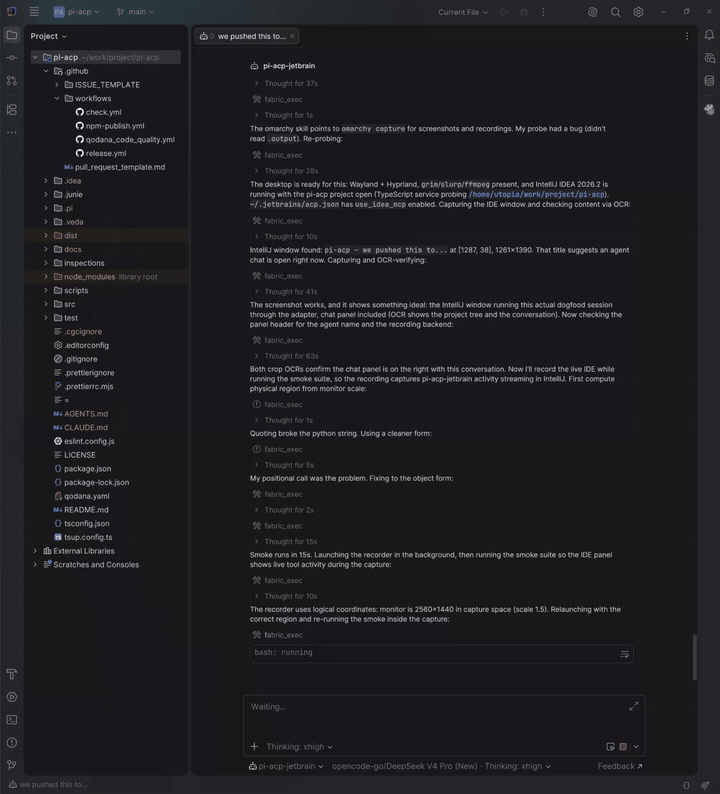
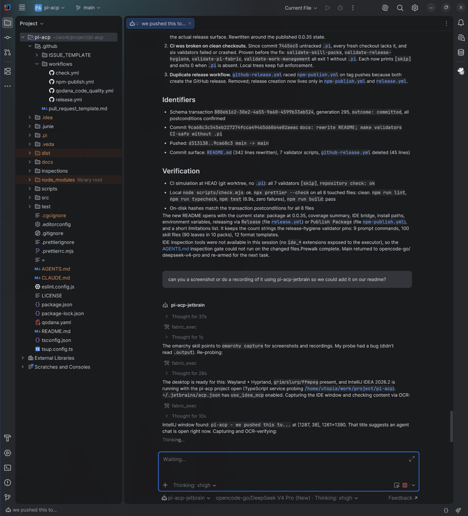

# pi-acp-jetbrain

[](https://www.npmjs.com/package/pi-acp-jetbrain)
[](https://www.npmjs.com/package/pi-acp-jetbrain)
[](LICENSE)
[](https://github.com/ryan-brosas/pi-acp-jetbrain/actions/workflows/check.yml)

An Agent Client Protocol (ACP) adapter for the pi coding agent. JetBrains IntelliJ is the primary host. Other ACP clients work with partial coverage.

The adapter runs as an ACP server over stdio. Each ACP session starts one `pi --mode rpc` subprocess. The adapter translates messages between the client and pi.

npm package: `pi-acp-jetbrain` at 0.0.36. GitHub Actions publishes each release with signed provenance.

## In action





## Coverage

The adapter covers the session surface: `session/new`, `session/prompt`, `session/cancel`, `session/list`, `session/load`, `session/fork`, `session/resume`, `session/close`, `session/delete`. Pi keeps its own session files. The adapter keeps a small map at `~/.pi/pi-acp/session-map.json` so a load can reattach to the stored session.

Assistant text streams as `agent_message_chunk`. Reasoning streams as `agent_thought_chunk` when the provider sends it. Tool runs map to `tool_call` and `tool_call_update` events.

Edit events carry a file location when pi reports a path. The adapter resolves relative paths against the session working directory. For text edits it finds the changed line from one unique match and reports a structured diff.

Each session starts with a pi startup block. Set `quietStartup: true` in pi settings to hide it.

After each settled turn the adapter reports token use and cost from pi session statistics. It sends the data on the unstable `usage` field.

Text input requests use the unstable ACP elicitation API when the client has it. Requests that fit permissions route through ACP permissions. An editor request shows a cancellation notice because elicitation forms hold primitive fields only.

The model selector works through a mapping from pi models to ACP provider info. Pi keeps provider credentials outside the RPC surface.

Slash commands load file-based prompts from pi and a set of built-ins: `/compact`, `/export`, `/session`, `/name`, `/queue`, `/changelog`, `/steering`, `/follow-up`. Skills appear as `/skill:<name>` when enabled in pi settings.

The local tree carries pi developer tooling: 9 prompt commands, 100 skill files (90 leaves in 10 packs), and 12 format templates under `.pi/`. These checks run in the development tree and skip on clean CI checkouts.

## IntelliJ IDE bridge

IntelliJ sends its built-in MCP server descriptor with each chat. The adapter exposes those IDE tools to pi as `ide_<server>_<tool>` extension tools.

The bridge opens a direct MCP-over-SSE client against `http://127.0.0.1:<IJ_MCP_SERVER_PORT>/sse` when the descriptor carries that port. It starts the stdio child only when that endpoint is unreachable.

Two allowlists guard the IDE tools. The IDE side reads `idea_mcp_allowed_tools` from `~/.jetbrains/acp.json`. An omitted key means AllowAll in the installed build. The adapter side deny-lists `execute_tool` and every `xdebug_*` name. Set `PI_ACP_IDE_EXTRA_TOOLS` with a comma separated list of remote names to re-allow tools you reviewed.

The session catalog never changes. After you edit IntelliJ MCP settings or the allowlist, open a new chat.

## Install

Node.js 20 or newer. The pi executable on your PATH.

Install it as a Pi package to activate the bundled bridge extension:

```bash
pi install npm:pi-acp-jetbrain
```

Pi records the package in `~/.pi/agent/settings.json` and enables its declared extension automatically. Installing only with `npm install -g` provides the executable but does not activate Pi package resources.

Install the `pi-acp` command globally when you want it directly on your PATH:

```bash
npm install -g pi-acp-jetbrain
```

The package name is `pi-acp-jetbrain`. The installed command stays `pi-acp`.

Register the adapter in `~/.jetbrains/acp.json`:

```json
{
  "agent_servers": {
    "pi-acp-jetbrain": {
      "command": "pi-acp",
      "args": [],
      "env": {}
    }
  }
}
```

npx works too. Pin the version so a later start cannot fetch a different release:

```json
{
  "agent_servers": {
    "pi-acp-jetbrain": {
      "command": "npx",
      "args": ["-y", "pi-acp-jetbrain@0.0.36"],
      "env": {}
    }
  }
}
```

From source:

```bash
npm install
npm run build
```

Point the entry to `dist/index.js`:

```json
{
  "agent_servers": {
    "pi-acp-jetbrain": {
      "command": "node",
      "args": ["/path/to/pi-acp-jetbrain/dist/index.js"],
      "env": {}
    }
  }
}
```

A development profile with a conservative tool subset:

```json
{
  "agent_servers": {
    "pi-acp-jetbrain": {
      "command": "/path/to/pi-acp-jetbrain/dist/index.js",
      "args": [],
      "env": {
        "PI_ACP_PI_COMMAND": "/path/to/pi",
        "PI_ACP_DEBUG_BRIDGE": "1"
      },
      "idea_mcp_allowed_tools": [
        "search_symbol",
        "get_symbol_info",
        "analyze_calls",
        "search_text",
        "search_regex",
        "get_file_problems",
        "lint_files",
        "build_project",
        "execute_run_configuration",
        "git_status",
        "get_repositories",
        "get_project_modules",
        "get_project_dependencies",
        "list_directory_tree",
        "read_file",
        "search_file",
        "open_file_in_editor",
        "get_all_open_file_paths",
        "skill_search"
      ]
    }
  }
}
```

`idea_mcp_allowed_tools` acts as a deny-all mask plus the named tools. Add tools as you need them.

## Environment variables

| Variable                              | Effect                                                                                                 |
| ------------------------------------- | ------------------------------------------------------------------------------------------------------ |
| `PI_ACP_PI_COMMAND`                   | Path to the pi executable. Default: `pi`.                                                              |
| `PI_ACP_DEBUG_BRIDGE=1`               | Log the sanitized `session/new` MCP descriptor to stderr. IntelliJ writes that stderr into `idea.log`. |
| `PI_ACP_ENABLE_EMBEDDED_CONTEXT=true` | Advertise `embeddedContext` support.                                                                   |
| `PI_ACP_ENFORCE_IDE_INSPECT=0`        | Disable the inspection gate that runs after each turn.                                                 |
| `PI_ACP_IDE_INSPECT_DIR`              | Move inspection reports out of the project tree.                                                       |
| `PI_ACP_SESSION_MAP`                  | Override the session map path. Default: `~/.pi/pi-acp/session-map.json`.                               |
| `PI_ACP_IDE_EXTRA_TOOLS`              | Re-allow deny-listed IDE tools. Comma separated remote names.                                          |

## IntelliJ-first coding mode

Set `PI_ACP_IDE_MODE` to control how the session uses IntelliJ for normal coding work. Pi still generates every implementation; IntelliJ opens, reads, searches, applies, renames, reformats, and validates.

- `off` (default) keeps the current behavior: IDE tools are exposed alongside native tools, nothing is removed, no extra prompt guidance.
- `prefer` removes the native `read`, `edit`, `write`, `grep`, `find`, and `ls` tools from the active set when the required IDE capabilities register. If the IDE bridge degrades, those tools come back and the session gets an explicit fallback notice.
- `required` removes the same native tools immediately and keeps them removed if the IDE bridge is missing or loses connection. The session reports that the task is blocked until a new healthy chat starts.

Required capabilities: `read_file`, `open_file_in_editor`, `apply_patch`, `create_new_file`, one search tool, and one inspection tool. Tool names are discovered from the live catalog, never guessed.

In active modes, mutations run through IntelliJ and open the affected files: existing files open before `apply_patch`, created and moved files open after. Patch targets and path arguments are confined to the ACP project root; paths outside it are rejected, including symlink escapes. Search results that name files outside the root are annotated in `prefer` and rejected in `required`.

Bash stays available in `prefer` for Git, tests, builds, and diagnostics. Unrestricted bash can still mutate files, so this mode is policy enforcement for normal coding tools, not a filesystem sandbox. Do not rely on it as a security boundary.

Set the variable for the adapter process, for example in `~/.jetbrains/acp.json`:

```json
{
  "agent_servers": {
    "pi-acp-jetbrain": {
      "command": "/path/to/pi-acp/dist/index.js",
      "env": { "PI_ACP_IDE_MODE": "prefer", "PI_ACP_PI_COMMAND": "/path/to/pi" }
    }
  }
}
```

## Authentication

The adapter advertises terminal auth metadata. Run this command for interactive provider login:

```bash
pi-acp --terminal-login
```

ACP clients can start the same command from their auth UI.

## Development

```bash
npm install
npm run dev        # run from src with tsx
npm run build
npm run lint
npm run test
npm run typecheck
npm run format
npm run smoke      # core stdio smoke tests
npm run smoke:full # full matrix; run this before a release
node scripts/check.mjs
```

Code layout:

- `src/acp/` holds the ACP server and translation.
- `src/pi-rpc/` holds the pi subprocess wrapper.

CI: `check.yml` runs the canonical check, tests, lint, typecheck, and build on Node 20 and 24. `qodana_code_quality.yml` runs a Qodana Cloud scan and needs a `QODANA_TOKEN` repository secret. CI runs on Linux. Windows paths exist in the code and stay untested.

## Releasing

Each release publishes to npm from GitHub Actions with signed provenance. No interactive npm 2FA on CI.

Start a release with:

```bash
gh workflow run Release -f version=0.0.36
```

Workflow `Release` (file `release.yml`) validates the version, bumps the package files, runs the gates, commits, tags, pushes, publishes, and creates a GitHub release.

Workflow `Publish Package` (file `npm-publish.yml`) runs on a `v*` tag push. It verifies the tag matches the package version and that npm lacks the version. Then it publishes and creates a GitHub release.

One-time setup for the package owner: on npmjs.com open the package Settings and the GitHub Cloud CI/CD form. Authorize `ryan-brosas/pi-acp-jetbrain`, branch `main`, with workflow filenames `npm-publish.yml` and `release.yml`.

## Limitations

The adapter does not expose ACP filesystem or terminal delegation. Pi reads files and runs commands locally.

`providers/set` and `providers/disable` return a method-not-found error. Pi configures providers outside the RPC surface.

The ACP plan surface stays unwired. The installed SDK does not define a plan method.

Debugger tools register only while an IDE debug session is live. Start a debug session and open a new chat to see them.

After you rebuild the adapter, open a new chat. Node keeps the old files loaded, and IntelliJ reuses running agent processes.

## License

MIT. See [LICENSE](LICENSE).
